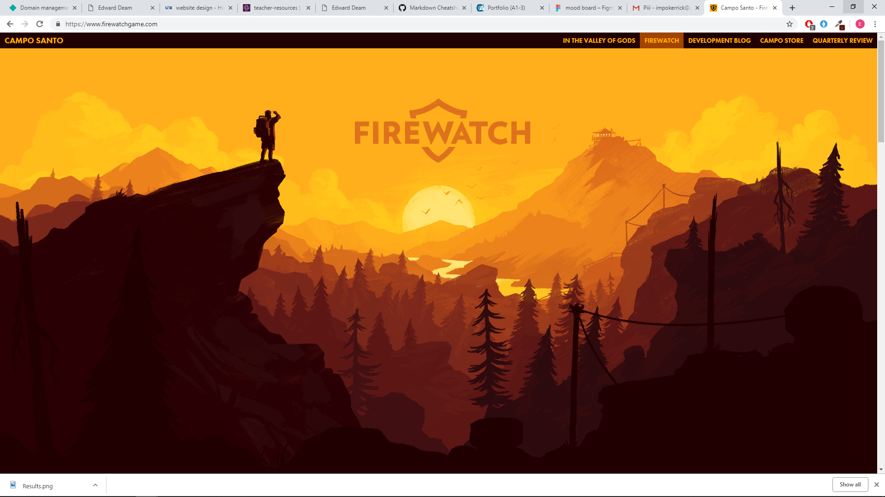
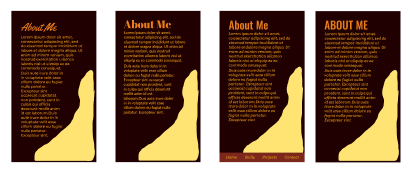

# Portfolio Website Project
### Github link
https://github.com/EdwardDeam/Portfolio-Website
### Deployed Website
https://jolly-neumann-7c7f7a.netlify.com/
## Purpose and Functionality
A website to showcase my development skills and previous projects to future employers. The website is easy to use and navigate, it is contained on a single page that the user can scroll and has a navigation bar should they want to jump to a specific section. 
## Screen Shots

## Target Audience
The target audience of this website is businesses looking for a developer to hire, recruiting agencies with a role to fill or clients who are looking for someone to build a web project for them.
## Tech Stack
The technology used in the creation of this page was
- HTML
- CSS
- JavaScript
- Photoshop
- Netlify

## Design Process
### Mood Board

The idea for a parallax scrolling website came from my interest in old video game graphics technology, it was used to give the illusion of movement. I thought that it would be a nice aesthetic for a scrolling based website and give the user a reason to keep looking through the site.
The colour scheme was based off a promotional image for a video game called 'Fire Watch'. 

The way that the 3d parallax was achieved was based off the [code pen](https://codepen.io/samdbeckham/pen/OPXPNp) by Sam Beckham, as well as the tutorial by [Keith Clark](https://keithclark.co.uk/articles/pure-css-parallax-websites/). 
Then adapted for the images that I had created. The inspiration for the design came both from video game art that I liked as well as from my experience living the rocky mountains in Canada. Much of the art is based off photographs that I took during my time there, and old advertisement material that I got from the area.
I looked at a few colour scheme gradients but felt that a sunset/autumn look worked best. 
 

For the fonts, I trialled a few different combinations eventually settling on Oswald and Arvo Italic. I kept the same font scheme for the entire website. I also tried to keep the colours consistent in both the page design and the artwork.

The site was designed with both mobile and large desktop and tablet displays in mind. The mobile site had a disappointing look in landscape mode and required the site to be almost completely redesigned so I decided to only support portrait and show the user a message asking them to rotate their phone.
### Wireframes and Site Map

For the basic structure of the website, I chose to use a single scrolled page rather than a collection of smaller pages. I feel that, especially on a phone, it is easier to scroll to find the information that you want rather than have to navigate through a bunch of hyperlinks. The site does, however, have a navigation bar so that users can jump to the section that they require immediately. The navigation bar on the mobile is a selection of icons rather than the typical hamburger styled menu. this allows the user the easily get the information that they are looking for as well as setting it apart from the classic mobile design.
### Figma Layouts

The site was also designed to be upgradeable, the skills section has sections left blank with placeholder divs to add segments for the skills we will learn during the remainder of the course. The project section is also expandable with a  flexbox and card design so that more projects can be added as they are completed during my time at Coder Academy.

The project was planned on trello

I tried to split the tasks evenly across all days to give my self a realistic work schedule and to allow time in case i came across problems when building the site. I also left one day with on scheduled tasks as a safety net in case I faced a major problem that slowed me down.

## SHORT ANSWER QUESTIONS
Describe key events in the development of the internet from the 1980s to today (max. 150 words)
In 1982 the US Department of Defence declares TCP/IP as the standard for all military computing. Becomes official in 1983 when hosts connected to ARPANET switched over to TCP/IP.
Bulletin Board Systems become popular in the mid-1980s as modem prices become more affordable. As modems became faster, these systems become more prominent and commercial services like America Online began to show up. In the early 90s many privately owned systems began to merge while commercial ones merged with the internet.
The internet browser Mosiac(Netscape)is released in 1993, it's easy to install and use, sparks a broader public interest. Early websites are limited by what HTML can do, being essentially an interactive word document.
Social networking becomes popular with Myspace in 2005 and Facebook soon after.
Recently everything is becoming connected to the internet. The internet has gone from being a tool to a part of our lives.

Define and describes the relationship between fundamental aspects of the internet such as: domains, web servers, DNS, and web browsers (max. 150 words)
A web browser allows a user to type in the name of a website (www.website.com) and then have that page displayed to the user. It is also responsible for graphically showing the website and executing any styling or scripts that may be attached to it. The Domain Name System(DNS) translates that name to an IP address that says which web server is hosting that website. Web servers provide storage and an IP address. When you 'visit' the website the web browser requests the server to pull the pages for you. A Domain is a name that you type into your web browser to describe what site you want to visit, it is easier than remembering each IP address. Domain registras register a domain and allow its use on the internet, it tells the rest of the web which DNS server to use for your domain.

Reflect on one aspect of the development of internet technologies and how it has contributed to the world today (max. 150 words)
The Mosiac Browser
Mosaic was the web browser that popularized the world wide web and the internet. It gained its name from its support of multiple internet protocols. I was the first web browser to display images and text together instead of displaying them n a separate window. It was developed by NSCA in late 1992 and released in 1993. It was discontinued in 1997, as it had lost most of its market share to Netscape Navigator by then. However,  It's technology was licensed by Microsoft to create its Internet Explorer in 1995.
Near the end of 1992 there where 26 websites in the world. Mosiac had a 'what's new' page with around one link added per day. the number of websites grew to 10,000 by 1995 and in the millions by 1998. I believe that the Mosiac browser was pivotal in the public explosion of interest in the internet.